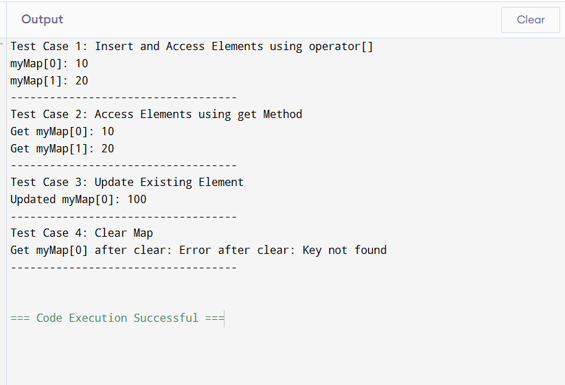

# Custom Map Implementation in C++

## Overview

This project implements a custom `Map` class in C++ using Object-Oriented Programming principles. It leverages a binary search tree to store key-value pairs and provides basic map operations such as inserting, updating, accessing, and clearing elements. This implementation supports the concept of a **sorted map**, where the elements are always sorted based on the keys.

## OOP Principles Applied

This project demonstrates the application of the four main Object-Oriented Programming (OOP) principles:

### 1. **Encapsulation**
- **Node Class**: The `Node` class encapsulates the data of the key-value pairs. It keeps the key, value, and pointers to the left and right child nodes private, ensuring the internal structure of the binary tree is hidden from the user.
- **Map Class**: The `Map` class encapsulates the entire map structure and its operations (e.g., `insert`, `get`, `clear`), providing a public interface for interacting with the map while hiding the underlying complexity of the data structure.

### 2. **Abstraction**
- **AbstractMap Class**: The abstract class `AbstractMap` defines an interface with pure virtual methods like `get`, `put`, and `clear`. This abstraction allows different types of maps (like `Map`) to implement these operations while hiding the details of how they work.
- **Map Class**: The `Map` class inherits from `AbstractMap` and implements the abstract methods. It abstracts away the implementation details of the binary search tree, allowing the user to interact with the map without worrying about how the data is stored.

### 3. **Inheritance**
- **AbstractMap and Map Classes**: The `Map` class inherits from the `AbstractMap` class. This allows `Map` to reuse the interface defined in `AbstractMap` and implement the specific behaviors for its operations. This shows how inheritance allows for the extension of functionality while maintaining a common interface.

### 4. **Polymorphism**
- **Virtual Functions**: The methods in the `AbstractMap` class (like `get`, `put`, and `clear`) are declared as virtual functions, which enables polymorphic behavior. The `Map` class overrides these functions to provide its specific implementation. This allows different types of maps (if extended in the future) to provide their own versions of these methods.

## File Structure

- **Node.cpp**: Contains the implementation of the `Node` class for storing key-value pairs and the binary tree structure.
- **AbstractMap.cpp**: Defines the abstract `AbstractMap` class with pure virtual functions (`get`, `put`, `clear`).
- **Map.cpp**: Implements the map operations (inherited from `AbstractMap`).
- **Main.cpp**: Contains test cases to verify the functionality of the map.

## Key Features

- **Sorted Map**: The map stores elements in a binary search tree, ensuring that the elements are always sorted by key.
- **Operator Overloading**: Supports inserting and accessing elements using the `operator[]`.
- **Error Handling**: Provides error handling for operations like accessing non-existent keys.

## Operations and Their Complexities

### 1. **Insert (put)**
- **Time Complexity**: O(log N) - Since the map is implemented using a binary search tree, inserting an element takes logarithmic time.
- **Space Complexity**: O(1) - Insertion only requires constant space for each element.

### 2. **Access (get)**
- **Time Complexity**: O(log N) - Searching for a key in the binary tree takes logarithmic time.
- **Space Complexity**: O(1) - Accessing an element does not require additional space.

### 3. **Update (operator[])**
- **Time Complexity**: O(log N) - Updating a value takes logarithmic time due to the binary search tree structure.
- **Space Complexity**: O(1) - Updating a key-value pair requires constant space.

### 4. **Clear**
- **Time Complexity**: O(N) - Clearing the entire tree involves visiting each node, which takes linear time.
- **Space Complexity**: O(1) - No additional space is used when clearing the map.

## Example Usage

```cpp
#include <iostream>
#include "Map.h"

int main() {
    Map<int, int> myMap;

    // Test Case 1: Insert and access elements using operator[]
    std::cout << "Test Case 1: Insert and Access Elements using operator[]\n";
    myMap[0] = 10;
    myMap[1] = 20;

    std::cout << "myMap[0]: " << myMap[0] << std::endl;
    std::cout << "myMap[1]: " << myMap[1] << std::endl;
    std::cout << "-----------------------------------\n";

    // Test Case 2: Access element using get method
    std::cout << "Test Case 2: Access Elements using get Method\n";
    try {
        std::cout << "Get myMap[0]: " << myMap.get(0) << std::endl;
        std::cout << "Get myMap[1]: " << myMap.get(1) << std::endl;
    } catch (const std::runtime_error& e) {
        std::cout << "Error: " << e.what() << std::endl;
    }
    std::cout << "-----------------------------------\n";

    // Test Case 3: Update existing element using operator[]
    std::cout << "Test Case 3: Update Existing Element\n";
    myMap[0] = 100;
    std::cout << "Updated myMap[0]: " << myMap[0] << std::endl;
    std::cout << "-----------------------------------\n";

    // Test Case 4: Clear map
    std::cout << "Test Case 4: Clear Map\n";
    myMap.clear();
    try {
        std::cout << "Get myMap[0] after clear: " << myMap.get(0) << std::endl;
    } catch (const std::runtime_error& e) {
        std::cout << "Error after clear: " << e.what() << std::endl;
    }
    std::cout << "-----------------------------------\n";

    return 0;
}
```

## Output Example

```
Test Case 1: Insert and Access Elements using operator[]
myMap[0]: 10
myMap[1]: 20
-----------------------------------
Test Case 2: Access Elements using get Method
Get myMap[0]: 10
Get myMap[1]: 20
-----------------------------------
Test Case 3: Update Existing Element
Updated myMap[0]: 100
-----------------------------------
Test Case 4: Clear Map
Error after clear: Key not found
-----------------------------------
```

## Conclusion

This project demonstrates the implementation of a sorted map using binary search tree principles and covers the key operations (insert, access, update, clear) with proper error handling. The implementation adheres to all four pillars of Object-Oriented Programming, ensuring modular, extensible, and maintainable code.

---


